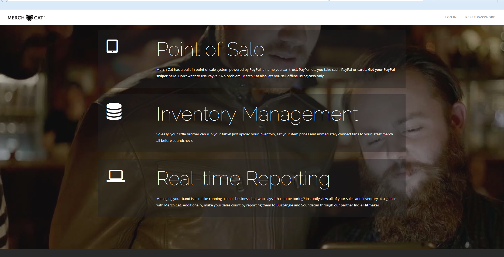
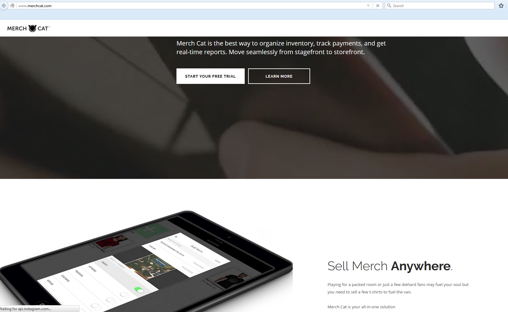

# merchcat.com

This is for merchcat company's web site.

# Technology Used.

1. language: Ruby
2. platform: Rails
3. front end script: jQuery, Coffeescript, Twitter bootstrap, CSS3
4. main gem: devise, puma, kaminari, grape(mini framework), aws-sdk, money, paperclip, roar, representable.
5. main feature: 
>1. CSV, PDF, XLS exporting.
>2. Payment integration using Stripe.
>3. Sendgrid API integration for mailing.
>4. AWS S3 - file uploading.
>5. RESTful API for mobile back end
>6. Mini framework for back end API using Grape gem.
>7. Promocode generation
>8. Responsive Web design using Twitter bootstrap.

6. hosting: Heroku deploying.

# Portfolio

